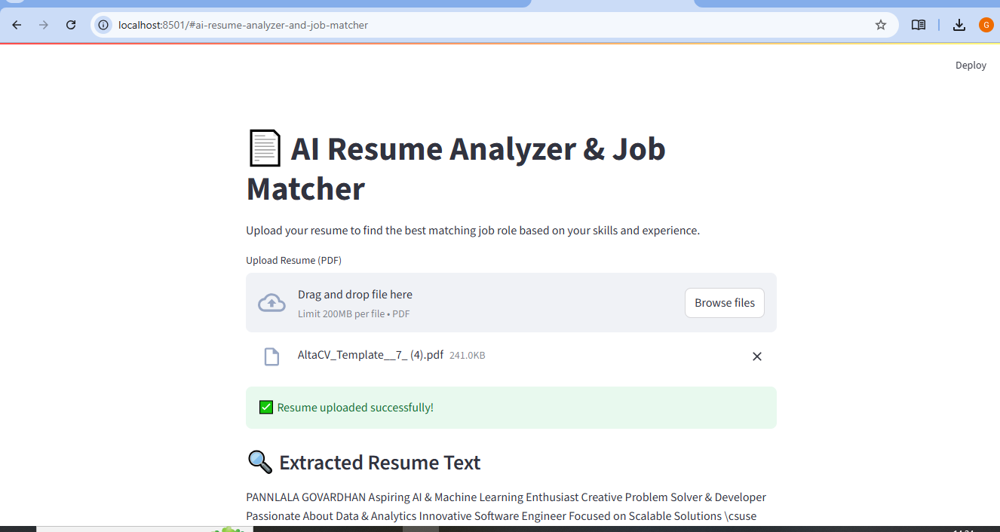

# 📄 AI Resume Analyzer & Job Role Matcher

This project is a Streamlit-powered AI tool that analyzes resumes (PDFs) and matches them to the best-fit job roles based on skill similarity using NLP.

### 🚀 Features

- 📤 Upload resume in PDF format
- 🧠 Extract text using `PyMuPDF`
- 📊 Match to top 3 job roles from `job_roles.csv`
- 📈 Shows similarity score using `TF-IDF` + `cosine similarity`
- 🧑‍💻 Simple, interactive web app via Streamlit

---

### 💻 Tech Stack

- Python 3.10
- Streamlit
- PyMuPDF (fitz)
- Pandas
- scikit-learn

---

### 📸 Demo Screenshot

---

### 📁 Folder Structure

